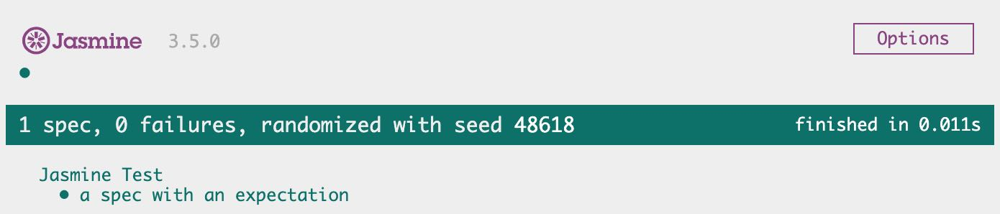

# Jasmine

参考文档已经很清楚了，基本 API 及示例都非常详细，下边对一些概念和技巧简单介绍

### 初始化一个 Jasmine 测试项目

```bash
jasmine init # npx jasmine init
```

### Jasmine 官方示例

```bash
jasmine examples # 这个会自动生成示例代码
```

### jasmine.json

Jasmine 的配置文件

```js
{
  "spec_dir": "spec", // 测试用例目录
  "spec_files": ["**/*[sS]pec.js"], // 需要进行测试用例的文件，正则匹配
  "helpers": ["helpers/**/*.js"], // help文件匹配规则，他会在测试用例文件 `specs` 之前加载并执行
  "stopSpecOnExpectationFailure": false,  // 在同一个it中，是否在遇到失败断言的时候就停止测试其他用例
  "random": true // 是否随机运行 it 中的用例
}
```

### 测试报告

默认的测试报告没有具体的测试信息输入，且难看，如下：

```bash
> jasmine

Started
.....

5 specs, 0 failures
Finished in 0.017 seconds
```

#### 添加报告

```bash
npm install jasmine-spec-reporter --save-dev
```

然后添加到测试用例代码中

```js
var SpecReporter = require("jasmine-spec-reporter").SpecReporter;

jasmine.getEnv().clearReporters(); // remove default reporter logs
jasmine.getEnv().addReporter(
  new SpecReporter({
    // add jasmine-spec-reporter
    spec: {
      displayPending: true,
    },
  })
);
```

输出如下结果，且有颜色的：

```bash
> jasmine

Jasmine started

  Player
    ✓ should be able to play a Song

    when song has been paused
      ✓ should indicate that the song is currently paused
      ✓ should be possible to resume

    ✓ tells the current song if the user has made it a favorite

    #resume
      ✓ should throw an exception if song is already playing

Executed 5 of 5 specs SUCCESS in 0.02 sec.
```

### Jasmine Html 测试报告

新建 `index.html` 文件

```html
<!DOCTYPE html>
<html lang="en">
  <head>
    <meta charset="UTF-8" />
    <meta name="viewport" content="width=device-width, initial-scale=1.0" />
    <meta http-equiv="X-UA-Compatible" content="ie=edge" />
    <title>Document</title>
    <!-- Jasmin 文件引入 -->
    <link rel="shortcut icon" type="image/png" href="./node_modules/jasmine-core/images/jasmine_favicon.png" />
    <link rel="stylesheet" type="text/css" href="./node_modules/jasmine-core/lib/jasmine-core/jasmine.css" />
    <script type="text/javascript" src="./node_modules/jasmine-core/lib/jasmine-core/jasmine.js"></script>
    <script type="text/javascript" src="./node_modules/jasmine-core/lib/jasmine-core/jasmine-html.js"></script>
    <script type="text/javascript" src="./node_modules/jasmine-core/lib/jasmine-core/boot.js"></script>
  </head>
  <body>
    <!-- 需要测试的 JS文件 及 Jasmine 测试脚本 -->
    <script type="text/javascript" src="./spec/jasmine_examples/spec.dom.js"></script>
  </body>
</html>
```

<div align="center">

</div>

## 参考

- [Jasmine Node 文档](https://jasmine.github.io/setup/nodejs.html)
- [Jasmine 中文指南](https://yq.aliyun.com/articles/53426)
- [JavaScript 单元测试框架-Jasmine](http://www.cnblogs.com/zhcncn/p/4330112.html)
