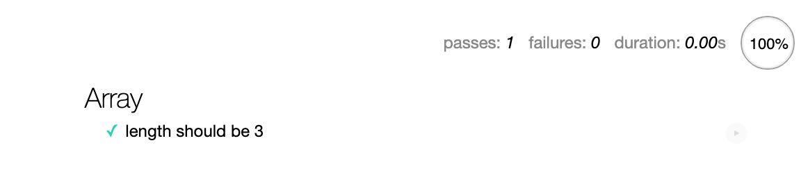

# Mocha

> Mocha 是一个功能丰富的 javascript 测试框架，运行在 node.js 和浏览器中，使异步测试变得简单有趣。Mocha 测试连续运行，允许灵活和准确的报告，同时将未捕获的异常映射到正确的测试用例

### done

异步测试中 Mocha 提供了 `done` 函数以表示完成执行

```js
beforeEach(function(done) {
  done();
});
```

### Promise

同样支持返回一个 `Promise`，`resolve` 函数的调用表示执行完成

```js
describe("counts", function() {
  it("should complete this test", function() {
    return new Promise(function(resolve) {
      assert.equal(count, 2);
      resolve();
    });
  });
});
```

注意： `Promise` 和 `done` 不能同时使用，**只能二选一**，如下会报错

```js
it("should complete this test", function(done) {
  return new Promise(function(resolve) {
    assert.equal(count, 2);
    resolve();
  }).then(done);
});
```

### Hooks

同样 Mocha 提供了执行周期 `Hook`，`before()`，`after()`，`beforeEach()` 和 `afterEach()`。

```js
describe("hooks", function() {
  before(function() {
    // 这个 describe 中所有测试 it，执行前执行，执行一次
  });

  after(function() {
    // 这个 describe 中所有测试 it，执行后执行，执行一次
  });

  beforeEach(function() {
    // 这个 describe 中每一个测试 it，执行前执行
  });

  afterEach(function() {
    // 这个 describe 中每一个测试 it，执行后执行
  });

  it("has a test", function() {
    assert.ok(true);
  });
});
```

### describe 嵌套

> 多个 describe 可嵌套

```js
describe("outter", function() {
  describe("inner", function() {
    it("is a inner test", function() {
      assert.ok(true);
    });
  });
});
```

### only

`only` 用于指定只运行此测试用例，可用在 `describe` 和 `it`

### skip

`skip` 表示跳过，不执行

### HTML 展示

```bash
mocha init YOUR_EXAMPLE_DIR_NAME # mocha init html
```

需要注意的是我们在浏览器中运行是需要引入 `断言库` 的，如 `assert` `chai`;

<div align="center">

</div>

## 参考

- [Mocha](https://mochajs.org/)
- [Mocha 中文网](https://mochajs.cn/)
- [测试框架 Mocha 实例教程](http://www.ruanyifeng.com/blog/2015/12/a-mocha-tutorial-of-examples.html)
- [Mocha 中文指南](https://yq.aliyun.com/articles/53427)
